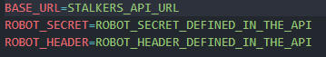

# Stalkers CLI

## Installation
1. CD to project directory
2. Create Virtual Environment
```bash
# Windows
py -m venv .venv

## Unix/Mac
python3 -m venv .venv
```
3. Initilize Virtual Environment
```bash
# Windows
.\.venv\Scripts\activate

## Unix/Mac
source .venv/bin/activate
```
4. Install Required packages
```bash
pip install -r requirements.txt
```
5. Load .env File
    - At the root of the project, create a `.env` file containing all the key/value pairs present in the .env.example file.

    

6. Run CLI
```bash
# Windows
py stalkers-cli

# Unix/Mac
python3 stalkers-cli
```